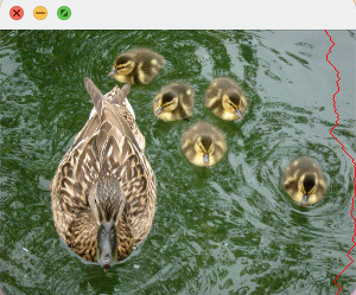

# Seam Carving Algorithm for Image Resizing

## Overview
This is a Java implementation of the Seam Carving algorithm, which allows you to resize images without distorting their content. This implementation uses dynamic programming to find the best seams to remove from an image. 

## Implementation Details
```run()``` takes in the RGB values of an image and calculates the energy for each pixel. The program then proceeds to find the best seam in the image using dynamic programming. It starts by initializing the first row of the ```bestWeight``` array with the energy values calculated for the first row of the input image.

After that, it iterates over the rest of the rows of the ```bestWeight``` array, filling in the values using the following formula:
```
bestWeight[i][j] = energy[i][j] + Math.min(Math.min(bestWeight[i - 1][j - 1], bestWeight[i - 1][j]), bestWeight[i - 1][j + 1]);
```
This formula calculates the best weight of the seam that ends at pixel (i,j) by taking the energy of that pixel and adding it to the minimum of the three possible paths the seam can take to reach that pixel.

At each pixel, the ```backtracking``` array is updated to keep track of the direction in which the seam goes.

Finally, the program finds the pixel with the minimum weight and follows the seam backwards by iterating over the ```backtracking``` array from the bottom row to the top row, starting at the pixel with the minimum weight in the last row. It returns the weight of the best seam to carve off.

## Run the Program
Several images are provided in the repo, and if he user doesn't specify any image in command line, the program will use default ```ducks.jpg``` as the test file. 
The program outputs the weight of the best seam and displays the image with the seam illustrated on it.
```
javac Main.java SeamCarving.java

java Main.java
```

Output:
```
Using ducks.jpg
weight: 2084.817620207777
seam: [274, 274, 275, 275, 276, 277, 278, 278, 278, 279, 280, 281, 281, 280, 279, 278, 278, 277, 278, 277, 276, 275, 275, 275, 275, 275, 276, 277, 278, 279, 280, 281, 282, 282, 283, 284, 285, 284, 284, 284, 285, 286, 285, 284, 283, 284, 284, 284, 285, 285, 285, 285, 284, 283, 282, 281, 281, 281, 280, 281, 281, 282, 281, 281, 282, 281, 282, 283, 282, 282, 283, 284, 285, 284, 284, 285, 284, 283, 283, 284, 283, 282, 281, 280, 279, 279, 278, 278, 279, 280, 281, 282, 283, 284, 285, 286, 287, 288, 289, 288, 288, 289, 290, 291, 292, 293, 294, 295, 296, 297, 297, 297, 298, 299, 299, 298, 299, 299, 299, 299, 299, 299, 299, 299, 299, 298, 298, 298, 299, 298, 299, 299, 299, 299, 299, 299, 299, 299, 299, 299, 299, 298, 297, 297, 297, 297, 297, 296, 297, 297, 296, 297, 296, 296, 295, 296, 296, 296, 297, 298, 299, 299, 299, 298, 299, 299, 299, 299, 298, 299, 298, 299, 299, 299, 298, 297, 297, 297, 297, 298, 299, 299, 298, 297, 296, 295, 294, 293, 294, 293, 292, 293, 294, 295, 296, 297, 296, 295, 294, 293, 292, 291, 290, 289, 288, 287, 286, 285, 284, 283, 283, 282, 281, 282, 283, 284, 285, 286, 286, 285, 286, 285, 284, 284, 283]
time: 0.111
```

